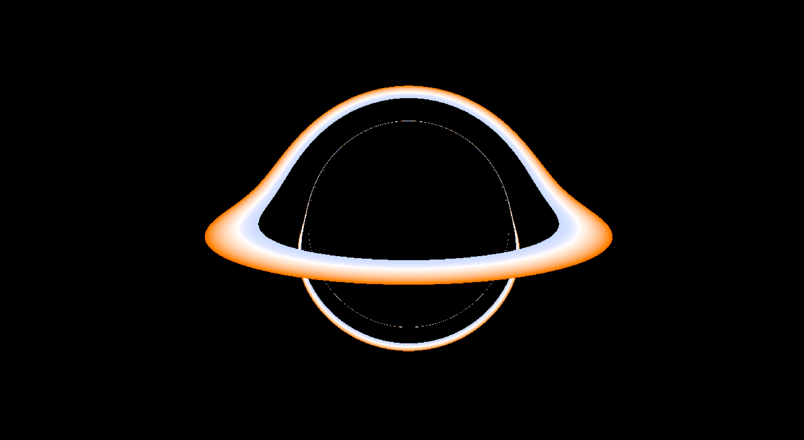
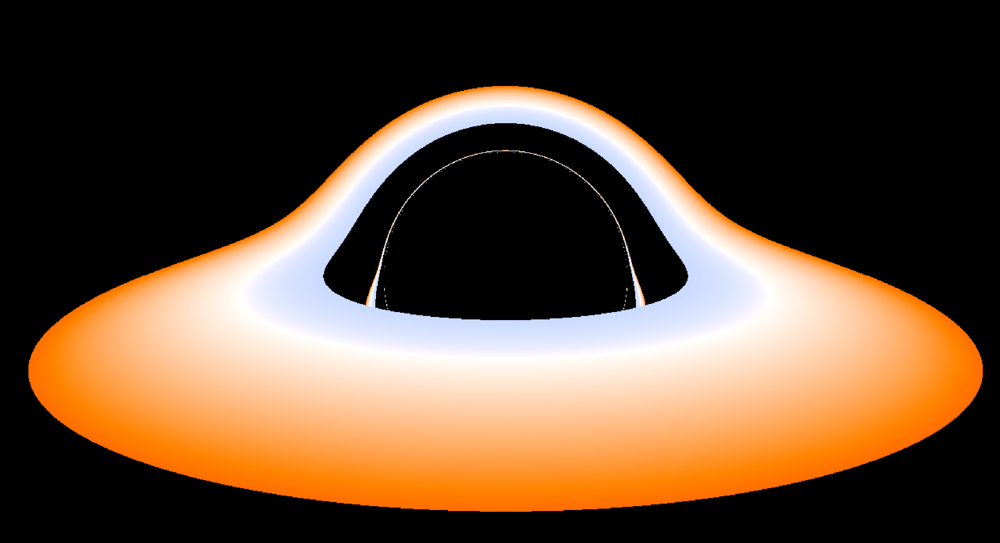

# Abyss

Real-time black hole renderer using GPU-accelerated ray tracing through curved spacetime.

Traces photon geodesics in the Schwarzschild metric to visualize gravitational lensing, the photon sphere, Einstein rings, and accretion disk emission. Built with CUDA/OpenGL interop. CUDA computes the physics, OpenGL displays the result.

#### Schwarzschild Model



## Stack

- **C++ / CUDA** — geodesic integration via RK4
- **OpenGL 4.5** — fullscreen quad display
- **GLFW / GLAD** — windowing and GL loading
- **CMake** — build system

## Build

Requires: CUDA Toolkit, Visual Studio 2022 (MSVC), vcpkg with `glfw3:x64-windows`.

Build using CMake

Use the following command to execute and your machine will start roleplaying as a jet taking off while you're mesmerized by the black hole.
```bash
./build/Debug/blackhole-sim.exe
```

## Architecture

```
src/
├── main.cpp              # Window, GL context, render loop
├── cuda_interop.cu/.h    # CUDA-GL texture bridge, camera setup
├── render_kernel.cu       # Per-pixel kernel dispatch
├── camera.cuh             # Ray generation, float3 math helpers
└── metrics/
    ├── metric.cuh         # Shared types (TraceResult, GeodesicState)
    └── schwarzschild.cuh  # Geodesic acceleration + RK4 integration
```

Metrics are modular — swap `schwarzschild::trace()` for `kerr::trace()` to render a rotating black hole. Camera, interop, and GL code stay untouched.

## Roadmap

- [x] CUDA-GL interop pipeline
- [x] Schwarzschild geodesic ray tracer
- [ ] Rotating black holes
- [ ] Charged black holes
- [ ] Generalized blackhole simulation framework
